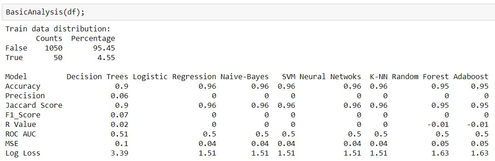
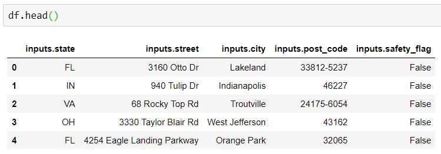

Performance Overview of Supervised Learning methods 
====================================================

Do not know which supervised learning method is good for your dataset?
Would you like to know it in just few seconds?

:Congratulations:
  You are about to learn about a package which gives you the solution to all above problems!

This small package of merely few bytes and code written in less than 100 lines, provide you the overview of all fundamental metrics measured for almost all supervised learning method.

+---------------------------------------------+---------------------------------------------+
|               Models evaluated:             |             Metrics considered:             |
+=====================+=======================+========================+====================+
|    Decision Trees   |  Logistic Regression  |        Accuracy        |      Precision     |
+---------------------+-----------------------+------------------------+--------------------+
|     Naive Bayes     |          SVM          |       Jaccard Score    |      F1_Score      |
+---------------------+-----------------------+------------------------+--------------------+
|   Neural Networks   |          K-NN         |      R (Corr. Coeff.)  |      ROC AUC       |
+---------------------+-----------------------+------------------------+--------------------+
|    Random Forest    |        Adaboost       |           MSE          |      Log Loss      |
+---------------------+-----------------------+------------------------+--------------------+

-------------------------------------------------------------------------------------------------------------------------

:Mandatory inputs required:
  A Pandas DataFrame

:Optional inputs in the given order:
  - Column numbers for the predictors in the form of a LIST 
      Default: It will take all columns except the last one.
  - Column number for the response in the form of a LIST
      Default: It will take the last column.
  - Test size in Float Ex. 0.3 for 30% Test Size.
      Default: 0.25 (25% Test size) will be assumed.

-------------------------------------------------------------------------------------------------------------------------

:How to install:
  Type ``pip install BasicAnalysis`` in command line to install the package
  
  To call the module from this package, type ``From BasicAnalysis import BasicAnalysis``
  
*Note : Some people had an issue with importing the module.*
  Solution: ``From BasicAnalysis.BasicAnalysis import BasicAnalysis``

-------

**Output:**
  Output will be:
  

For the following data:

------

README file for the task

Written in reStructuredText or .rst file, and used to generate the project page on PyPI. Images coming soon...
